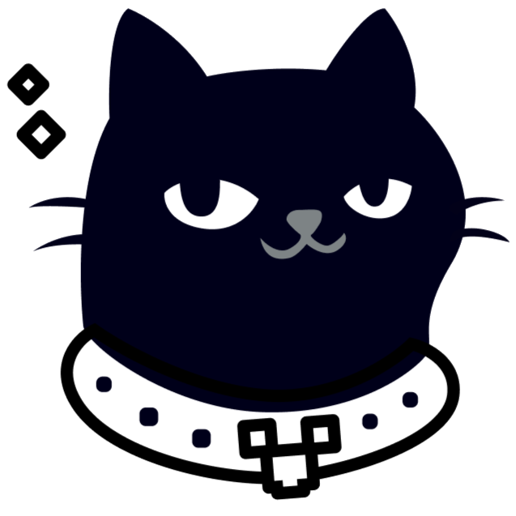

<h1 align="center">An ChatGPT/Claude Chat Web UI</h1>

[Web](https://gptferry.com)

## Features

- [Vue 3](https://vuejs.org/) & [Quasar](https://quasar.dev/)
- [PWA & SPA](https://gptferry.com) and Responsive
- Markdown by [markdown-it](https://markdown-it.github.io/)
- Code highlight by [highlight.js](https://highlightjs.org/)
- Latex by [Katex](https://katex.org/)
- Diagramming and charting by [Mermaid](https://mermaid.js.org/)
- Privacy: The data is stored in your locally Browser's IndexedDB
- I18n: English/简体中文
- ...

## Roadmap

- [ ] Get a Claude API key and test it

## Contributing

The project has installed tailwind.css for now, but try not to use it, as Quasar's help style classes will mostly do the job.

Contributions are welcome! Please follow the [code of conduct](./CODE_OF_CONDUCT.md) when interacting with others.
